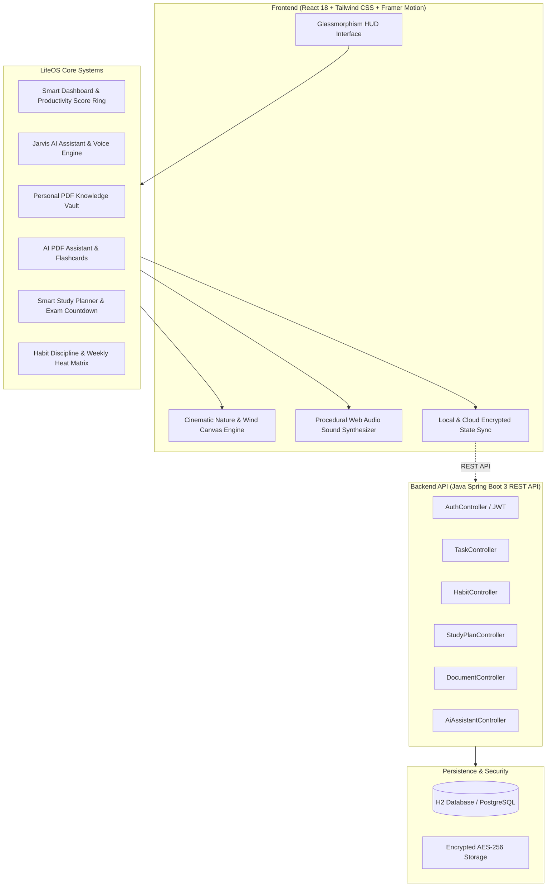

# 🌿 LifeOS — AI-Powered Personal Productivity & Nature Sanctuary

> **LifeOS** is a futuristic "Jarvis-style" personal assistant unified with a tranquil, living nature sanctuary. Seamlessly manage life goals, study syllabi, daily focus tasks, habit streaks, and private document vaults with embedded AI intelligence.

---

## 🌌 System Architecture



---

## ✨ Core Feature Highlights

### 1. 🏞️ Cinematic Nature Sanctuary & Procedural Audio Engine
* **Living Realistic Landscape:** Parallax layered mountain ranges, valley mist, drifting procedural cloud layers, and starry twilight / aurora / sunset skies.
* **Canvas Physics Grass:** Hundreds of procedural grass blades drawn directly on HTML5 Canvas, dynamically swaying with wind velocity and physics gusts.
* **Ambient Floating Motes:** Luminous fireflies and wind spores drifting across the meadow.
* **Zero-Dependency Web Audio Synthesizer:**
  * **Soft Wind:** Pink/Brown noise filtered through a dynamic bandpass oscillator with gentle LFO gust modulation.
  * **Bird Song:** Procedural sinusoidal FM tweets with randomized intervals.
  * **Gentle Rain:** Multi-filtered noise with dynamic lowpass envelopment.
  * **Calm Ambient Music:** Polyphonic soothing pentatonic chord pads ($F\text{maj}9 \rightarrow C\text{maj}7 \rightarrow A\text{m}9 \rightarrow E\text{m}7$).
  * Master volume slider, individual sound channels, and instant soundscape presets (*Zen Peace, Meadow, Soft Rain*).

### 2. ⚡ Main Dashboard & Productivity Score Ring
* **Personalized Greeting:** Contextual greeting based on hour of day (*"Good Morning, Alex 👋"*).
* **Futuristic HUD Clock & Live Environmental Vibe:** Real-time clock with seconds, date, and 22°C Clear weather preview.
* **Today's Focus Checklist:** Interactive task management with category pills (*Java, DSA, College, Health, Career*), priority tags (*Urgent, High, Normal*), and instant confetti celebrations on completion.
* **Animated Productivity Score Ring:** Dynamic circular SVG gauge calculating daily execution balance across tasks, habits, and focus hours.
* **Habit Streaks Quick Glance:** One-click habit logging from the main dashboard.
* **Weekly Momentum Graph:** Visual bar chart tracking focus hours and completion consistency from Monday to Sunday.

### 3. 🤖 AI Personal Assistant ("Jarvis / LifeOS Mentor")
* **Deeply Intelligent Mentor:** Sharp, technical, encouraging, and structured advice.
* **Context Awareness:** Directly connected to your active documents, active tasks, habit streaks, and exam dates.
* **Prompt Shortcuts:**
  * *"Create my study plan"*
  * *"Explain deadlock from my OS notes"*
  * *"Summarize this PDF"*
  * *"What should I do today?"*
  * *"Help me prepare for exams"*
* **Voice Synthesis & Input:** Integrated Text-to-Speech (Jarvis voice readout) and Web Speech microphone input.
* **Flexible AI Provider:** Works 100% out of the box with the built-in offline CS mentor engine, or connect your own **Google Gemini** or **OpenAI** API key in settings.

### 4. 📚 Personal PDF Knowledge Vault
* **Private Document Management:** Organized by folders (*College, Career, Personal*, plus custom folder creation).
* **Pre-Loaded Sample Documents:**
  * `Operating Systems.pdf` (Deadlocks, Process Synchronization, Paging, TLB)
  * `DSA Notes.pdf` (Trees, Graphs, Big-O, Dijkstra, Dynamic Programming)
  * `Cyber Security.pdf` (The CIA Triad, RSA, AES, OWASP Top 10)
  * `Resume.pdf` (Full Stack Software Engineer resume)
  * `Certificates.pdf` (AWS Solutions Architect, Oracle Java Professional)
  * `Goals.pdf` & `Plans.pdf` (Vision roadmap & Sovereign Day Protocol)
* **Full In-Browser PDF Previewer:** View document contents, copy text, export, rename, search, and delete.
* **Direct AI Hand-off:** One-click *"Ask AI"* button jumps directly into deep document analysis.

### 5. 🔬 AI PDF Assistant (Interrogate Notes)
* **Coffman Deadlock Analysis:** Full breakdown of the 4 necessary conditions (*Mutual Exclusion, Hold and Wait, No Preemption, Circular Wait*), prevention strategies, and Banker's algorithm safe state analysis.
* **Executive Chapter Summaries:** Rapid chapter-by-chapter outline with key formulas.
* **High-Yield Exam Questions:** Predicted university and technical interview questions with solution hints and mark weighting.
* **Interactive 3D Flashcards:** Active recall cards with 3D flip animation, mastery tracking, and celebratory confetti.
* **Document Q&A:** Ask any question directly against document text.

### 6. 🗓️ Smart Study Planner & Exam Countdown
* **Subject Portfolio:** Data Structures & Algorithms, Operating Systems, Cyber Security.
* **Exam Countdown Badges:** Real-time day counter (*"30 Days to Exam"*, urgency alerts).
* **Syllabus Module Checklists:** Track completion percentage with dynamic progress bars.
* **30-Day AI Master Schedule Generator:** Automatically generates structured phases (e.g. *Day 1–5: Arrays & Strings, Day 6–10: Linked Lists, Day 11–15: Trees, Day 16–20: Graphs, Day 21–25: Dynamic Programming, Day 26–30: Mocks*).
* **Push to Today's Tasks:** Instantly insert any study phase target into your daily dashboard checklist.
* **Spaced Repetition Reminders:** Day 1, Day 3, Day 7 retention alerts.

### 7. 🔥 Habit Discipline Tracker
* **Pre-Configured Core Habits:** Coding, Workout, Reading, Meditation, Deep Sleep (7.5h+), Learning Goals + Custom habits.
* **Flame Streak Counters:** e.g. 🔥 14-day coding streak, 🔥 21-day reading streak.
* **Weekly Heat Matrix:** Mon–Sun interactive check-in grid.
* **Monthly Analytics:** Total completion rate (e.g. 92%), longest streak, and Diamond tier consistency status.

### 8. 🛡️ Security & Vault Protection
* **Personal File Protection:** AES-256 client-side zero-knowledge encryption badge.
* **Private Cloud Sync Toggle:** Choose between local offline storage and Spring Boot / S3 cloud sync.
* **Session Lock:** Instant vault locking mechanism.

---

## 🚀 Quick Start Guide

### 1. Launch Frontend (React + Vite)
```bash
# Navigate to frontend
cd frontend

# Install dependencies (already installed)
npm install

# Start Vite dev server
npm run dev
```
Open **[http://localhost:5173](http://localhost:5173)** in your browser.

Or from the root directory:
```bash
npm run dev
```

### 2. Launch Backend (Java Spring Boot 3 REST API)
```bash
# Navigate to backend directory
cd backend

# Run with Maven
mvn spring-boot:run
```
The REST API starts on `http://localhost:8080`.
* **H2 Web Console:** `http://localhost:8080/h2-console`
  * JDBC URL: `jdbc:h2:mem:lifeosdb`
  * Username: `sa`
  * Password: `password`

### 3. Vercel Deployment
The repository includes `vercel.json` and a production build script ready for instant deployment:
```bash
npm run build
```
Or import directly into **Vercel** with root directory set to `.`.

---

## 🛠️ Technology Stack

| Layer | Technologies |
| :--- | :--- |
| **Frontend UI** | React 18, Tailwind CSS, Lucide React, Canvas Confetti |
| **Visual Effects** | HTML5 Canvas Nature & Grass Physics Engine, SVG Parallax |
| **Audio** | Procedural Web Audio API Synthesizer (Zero audio file dependencies) |
| **Voice AI** | Web Speech API (SpeechSynthesis & SpeechRecognition) |
| **Backend REST API** | Java 17/25, Spring Boot 3.3.4, Spring Data JPA, Spring Web |
| **Database** | In-Memory H2 (Instant development) / PostgreSQL Ready |
| **Cloud Storage** | AWS S3 / Firebase Storage Architecture Ready |
| **Deployment** | Vercel Ready (`vercel.json`) |

---

*LifeOS — Master your day, elevate your mind, and learn in peace.*
